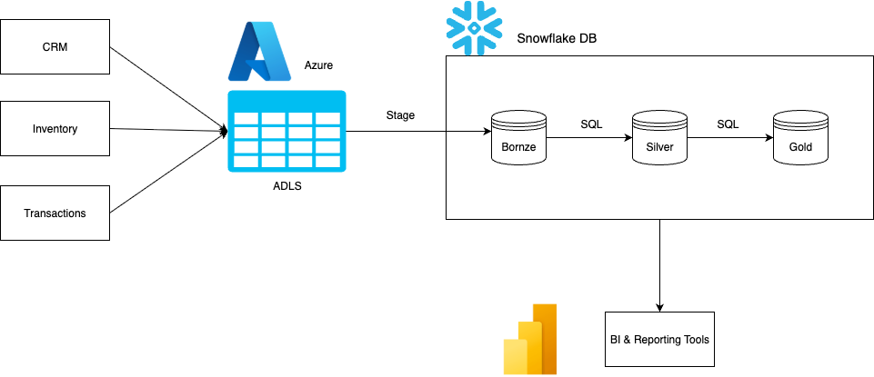
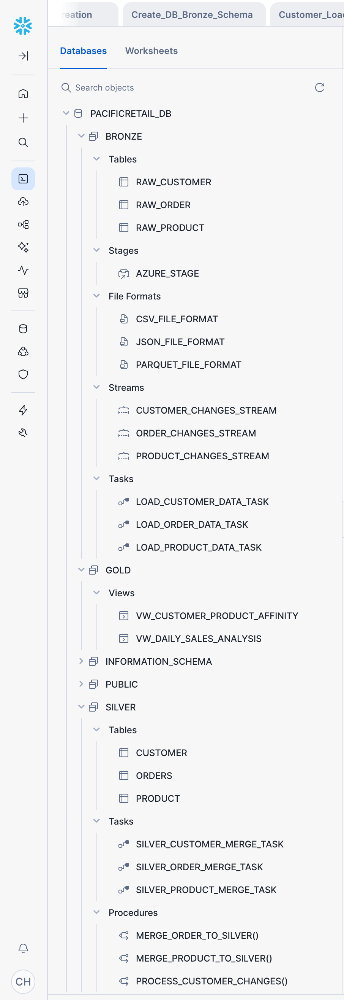
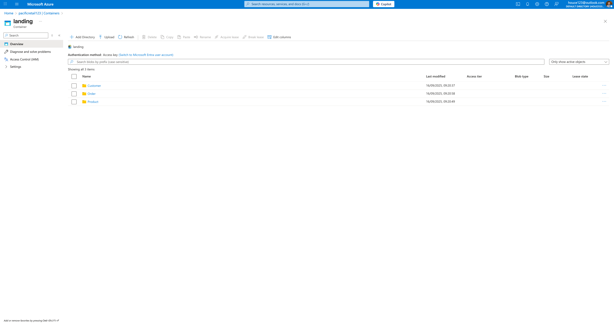
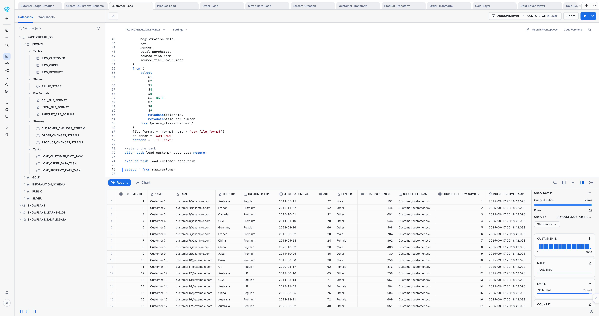
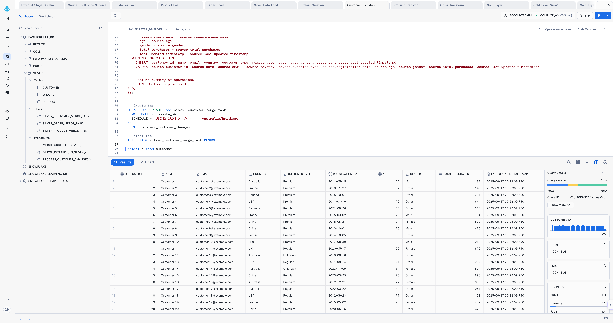
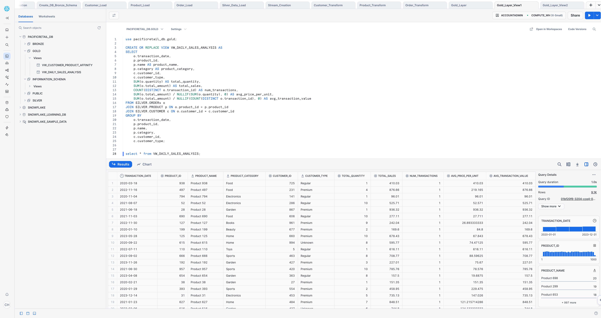

# PacificRetail Snowflake Data Engineering Project
[](https://azure.microsoft.com/)
[](https://www.snowflake.com/)
[]()
[](https://powerbi.microsoft.com/)
## 👤 My Role
As a **Data Engineer**, I designed and implemented this end-to-end Snowflake solution for PacificRetail.  
My responsibilities included:  
- Architecting the **Bronze–Silver–Gold layered data pipeline**  
- Implementing **data ingestion** from Azure Data Lake Storage (ADLS) into Snowflake  
- Developing **incremental processing** with Snowflake **Tasks & Streams**  
- Building **data quality checks & standardization logic**  
- Designing **business-ready data models** in the Gold layer for analytics and ML use cases  

---

## 📌 Project Overview
PacificRetail is a fast-growing e-commerce company operating in **15 countries** with:  
- **5M+ active customers**  
- **100K+ product catalog**  
- **Real-time transaction logs**  

The company faced challenges with **data silos, processing delays, poor scalability, and limited analytics capabilities**.  
This project showcases how Snowflake’s cloud-native architecture can overcome these bottlenecks and **enable near real-time reporting, advanced analytics, and ML readiness**.  

---

## 🎯 Business Goals
- **Reduce reporting latency** from **24h → 1h**  
- Achieve **99% accuracy** in cross-channel sales reporting  
- Support **5x growth** in data volumes with no performance degradation  
- Provide **self-service BI** to business teams  
- Build a foundation for **AI/ML use cases** (e.g., churn prediction, demand forecasting)  

---

## 🏗️ Solution Architecture

The solution uses a **multi-layer Snowflake architecture** with **ADLS as staging**:

1. **Data Sources**  
   - CRM system → CSV (daily export)  
   - Inventory management → JSON (hourly updates)  
   - E-commerce platform → Parquet (real-time logs)  

2. **Azure Data Lake Storage (ADLS)**  
   - Central landing zone for all raw data  
   - Cost-effective, scalable, supports multiple file formats  

3. **Snowflake Data Warehouse**  
   - **Bronze Schema** → Raw ingestion (append-only)  
   - **Silver Schema** → Clean & standardized data with incremental merges  
   - **Gold Schema** → Business-ready aggregates and models for BI/ML  

4. **Analytics Layer**  
   - Power BI / Tableau / Excel connected to Snowflake Gold layer  

---

## 🔄 Data Flow
1. Data lands in **ADLS** from source systems  
2. Snowflake **COPY INTO** loads data → **Bronze tables**  
3. Snowflake **Tasks + Streams** apply transformations → **Silver tables**  
4. Standardization & data quality checks applied  
5. Aggregates, views, and marts created → **Gold schema**  
6. BI/Analytics tools query the **Gold layer**  

---

## 🛠️ Key Snowflake Features Implemented
- **External Stages** → Connect Snowflake with ADLS  
- **COPY Command** → Load CSV, JSON, Parquet into Bronze tables  
- **Streams + Tasks** → Automate incremental processing & transformations  
- **MERGE Statements** → Handle updates in Silver schema  
- **Time Travel** → Historical data recovery and audit  
- **Zero-Copy Cloning** → Rapidly provision Dev/Test environments  

---

## 💻 Example SQL Snippets

**1. Create External Stage (ADLS → Snowflake)**  

```sql
create or replace stage adls_stage
url='azure://<storage_account>/<container>'
credentials=(azure_sas_token='<token>');
```
**2. Load Data into Bronze Layer**

```sql
copy into bronze.customer
from @adls_stage/customer/
file_format = (type = csv field_optionally_enclosed_by='"')
on_error = 'continue';
```
**3. Incremental Merge into Silver Layer**

```sql
merge into silver.customer as target
using (
  select customer_id, name, email, country, customer_type
  from bronze.customer
) as source
on target.customer_id = source.customer_id
when matched then update set
    name = source.name,
    email = source.email,
    country = source.country,
    customer_type = source.customer_type
when not matched then insert (customer_id, name, email, country, customer_type)
values (source.customer_id, source.name, source.email, source.country, source.customer_type);
```
**4. Create Business Aggregates in Gold Layer**  

```sql
create or replace table gold.sales_summary as
select 
    c.country,
    p.category,
    date_trunc('day', o.transaction_date) as sales_date,
    count(distinct o.transaction_id) as total_orders,
    sum(o.total_amount) as total_revenue,
    avg(o.total_amount) as avg_order_value
from silver.orders o
join silver.customer c
    on o.customer_id = c.customer_id
join silver.product p
    on o.product_id = p.product_id
group by c.country, p.category, date_trunc('day', o.transaction_date);
```
## ✅ Business Outcomes
- ⏱️ Reporting latency reduced from 24h → 1h
- 📊 99% accuracy in cross-channel reporting
- ⚡ 5x scalability with no performance degradation
- 👩‍💻 Self-service analytics enabled for business teams
- 🤖 ML-ready foundation for churn prediction, demand forecasting & personalization

## 🚀 Key Learnings
- Importance of layered architecture (Bronze/Silver/Gold) for flexibility
- Using Streams + Tasks to automate near real-time processing
- How Snowflake’s separation of storage & compute improves scalability
- Designing pipelines that balance cost efficiency with performance